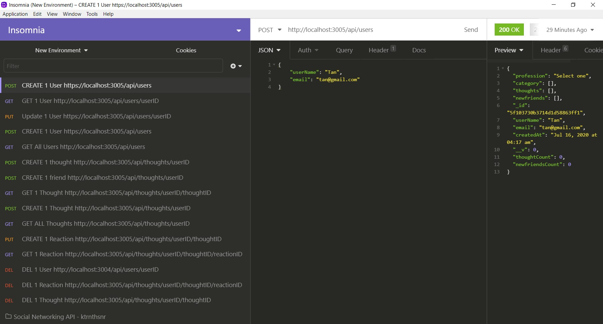
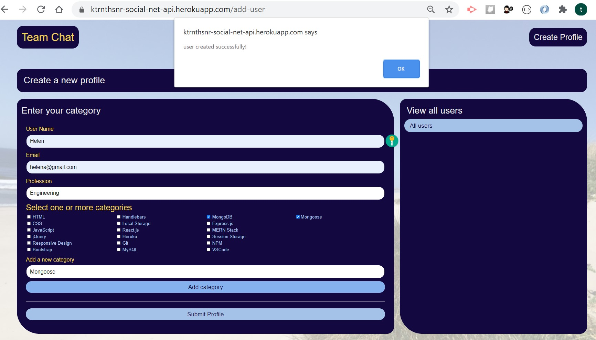
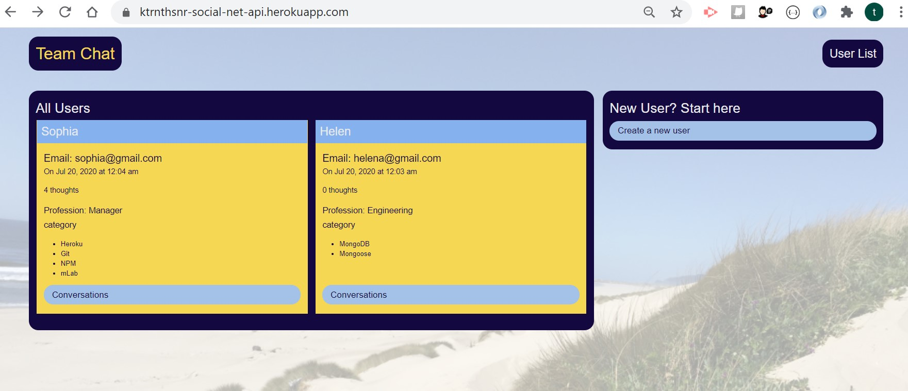
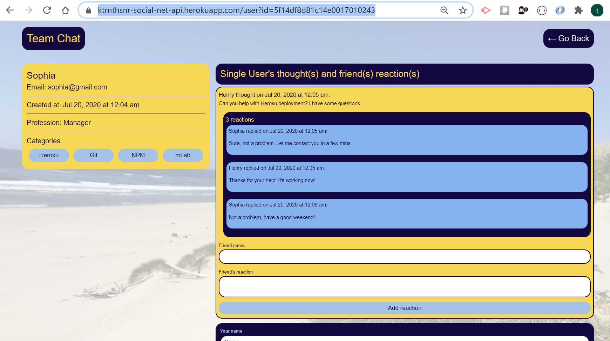

# Social Networking API

API back-end work required for a social networking application supported by a NoSQL MongoDB and MongooseJS library, API routes from an Express.js server, and routes tested through the Insomnia tool.

## GitHub & Website URL

- https://github.com/ktrnthsnr/SocialNetworkingAPI
- https://ktrnthsnr-social-net-api.herokuapp.com/

## Insomnia walkthrough API endpoint routes

https://drive.google.com/file/d/1MhNUBRcjmUpWy7scgmKuogrN39fYWdmA/view

## Table of Contents

* [Description](#description)
* [Technology](#technology)
* [Installations](#installations)
* [Usage](#usage)
* [Testing](#testing)
* [Userstory](#Userstory)
* [Contribution](#contribution)

## Description

- This is the API for a social networking application, where users may create a list of friends, then post some of their thoughts and also react to each other's thoughts. Additionally, users may be able to edit or delete these as well. 

- The Node.js based API uses Express.js for routing, MongoDB as data storage for the NoSQL backend database, Mongoose Object Data Management (ODM) system to create and manage the database queries on startup, and Moment.js npm package to format any time dependent aspects of the application. 

- This Readme.md includes a walkthrough of the backend portion of the work required by a website to provide large amounts of unstructured data.  The walkthrough listed under the TOC Usage, shows the application if it were cloned to a localhost and started at the Node.js commandline, with the API endpoints viewed through the Insomnia tool. Invoking the application at the bash terminal, the JavaScript begins with the start up of the Express.js server which then creates the Mongoose table models, syncing to the MongoDB backend. Then through the debugging Insomnia tool, you can view the API routes and JSON output shown when a user is created, their friends are added to their lists, and their thoughts and reactions to their friends' thoughts are added, updated or removed - basically the social interaction of a group of friends!

## Technology

MongoDB, Express.js, Mongoose JS, Insomnia, Node.js, JavaScript, ES6, npm, Moment.js

## Installations

- Prereq: install VSCode, Node.js on your desktop
- After cloning the GitHub repo to your local drive, run the following in the VSCode command-line terminal
- Install all components listed within the package.json file for npm
- $ `npm i`
- For custom installations, start with initializing npm
- $ `npm init -y` or $ `npm install`
- Install npm express, more info https://www.npmjs.com/package/express
- $ `npm install express`
- Manaully update the package.json to  `"main": "server.js",` instead of index.js
- Create a .gitignore file in the root and add `node_modules` to this file
- If you need to re-add the dependencies, run $ `npm install`
- Install MongoDB, first create a `c:/data/db` directory on your root, then install the Community Server from https://www.mongodb.com/try/download/community, excluding the compass from the installation, and adding the /bin folder to the environment variable PATH.
- Install the MoongooseJS library
- $ `npm install mongoose`
- Install npm Moment.js
- $ `npm install moment`

## Usage

- If this applicatin is cloned from github, completed the installation `npm i`, then start up at the bash commandline, by typing
- $ `npm start`

- Here is a sample containing JSON input and output for adding a user from POST API endpoint http://localhost:3005/api/users

- The website for this Team Chat social networking application is hosted on Heroku and served on the backend from the mLab add-on backend, shows new users, thoughts and reactions as follows:

Create a Profile
- 

Show a User List
- 

Show Thoughts and Reactions
- 

## Testing
- Download the Insomnia Core API tool https://insomnia.rest/download/
- For testing the routes locally, here are Insomnia API endpoints to GET, POST, PUT, DELETE a user for example,
- GET http://localhost:3005/api/users
- POST http://localhost:3005/api/users/(ID) (adding JSON for the required values within the model)
- PUT http://localhost:3005/api/users/(ID) (adding JSON for the required values within the model)
- DELETE http://localhost:3005/api/users/(ID)

- Troubleshooting:
- For any issues with the MongoDB versioning control, before instantiating the Express server `npm start`, you can reset the PORT under server.js and the database name under server.js and idb.js.

## Userstory

AS A social media startup
I WANT an API for my social network that uses a NoSQL database
SO THAT my website can handle large amounts of unstructured data

## Contribution

ktrnthsnr

### ©️2020 ktrnthsnr
